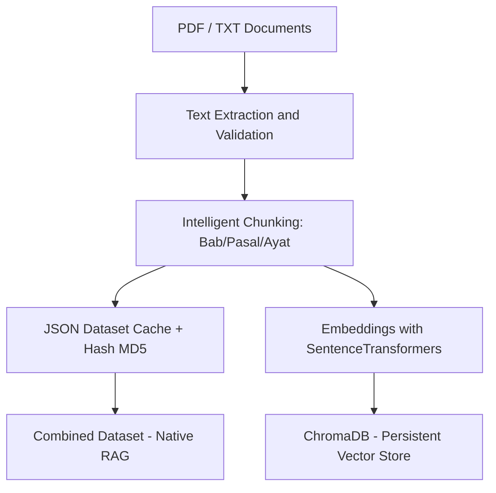
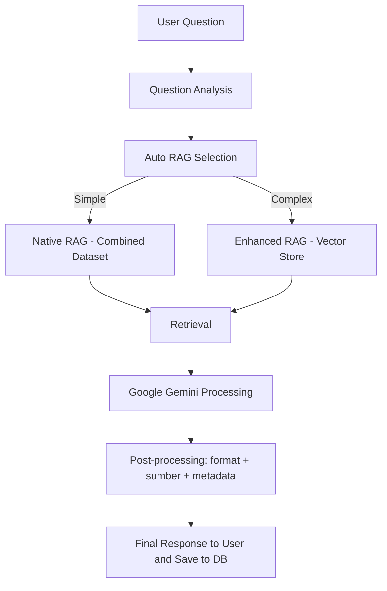

# CoPed (Constitutional Pedia Indonesia)

Platform edukasi digital untuk memahami UUD 1945 dengan chatbot berbasis Dual RAG (Native & Enhanced) yang terintegrasi Google Gemini.

---

## Manfaat

* Pembelajaran UUD 1945 yang terstruktur dan dapat ditelusuri.
* Chatbot AI yang menjawab berdasarkan dokumen sumber.
* Dual RAG: **Native** (cepat) & **Enhanced** (lebih presisi pada kueri kompleks).
* Dukungan multi-dokumen (UUD 1945, amandemen, penjelasan).
* Multi-room chat dengan histori percakapan.

---

## ⚡️ Data Flow (Data Processing Flow)



---

## 💬 Query Flow (Query Processing Flow)



---

## Tech Stack & Instalasi Singkat

**Backend:** Node.js, Express.js, Python (services), MongoDB Atlas, Google Gemini API
**Frontend:** Next.js, React, TypeScript, Tailwind CSS
**AI/RAG:** LangChain, ChromaDB, SentenceTransformers, PyPDF
**Auth/Security:** JWT, bcryptjs, CORS

### Prasyarat

* Node.js ≥ 18, Python ≥ 3.8
* Akun MongoDB Atlas
* Gemini API key

### Instalasi

```bash
# 1) Clone
git clone https://github.com/Nabilmln/CoPed-Constitutional-Pedia-.git
cd CoPed

# 2) Backend
cd backend
npm install
cd "gemini API"
pip install -r requirements.txt

# 3) Frontend
cd ../../frontend
npm install

# 4) Environment (backend/.env)
# contoh
MONGODB_URI=mongodb+srv://<conn-string>
JWT_SECRET=<secret>
GEMINI_API_KEY=<key>
PORT=3001

# 5) Run (dev)
# Terminal A
cd backend && npm start
# Terminal B
cd frontend && npm run dev
# Frontend: http://localhost:3000  |  Backend: http://localhost:3001
```

---

## Struktur Proyek (Ringkas)

```
CoPed/
├─ backend/
│  ├─ app.js
│  ├─ controllers/chatController.js
│  ├─ routes/chatRoutes.js
│  ├─ services/geminiServices.js
│  └─ gemini API/
│     ├─ api_bridge.py
│     ├─ dataset_builder.py          # Native RAG
│     ├─ langchain_enhanced_rag.py   # Enhanced RAG
│     ├─ document_cache.py
│     ├─ rag_selector.py
│     ├─ data/
│     ├─ cache/
│     ├─ chroma_db/
│     └─ dataset_cache/
├─ frontend/
│  ├─ src/app/(layout, page, chat, home)
│  ├─ src/components/(Header, FormattedResponse, ui)
│  ├─ src/services/api.ts
│  └─ src/lib/utils.ts
├─ start-app.bat
├─ start-app-optimized.bat
└─ README.md
```

---

## API Documentation (Ringkas)

### Chat Endpoints

#### POST `/api/chat/question`

**Body**

```json
{
  "question": "Apa isi Pasal 28A UUD 1945?",
  "ragType": "auto",  // auto | native | enhanced
  "roomId": "optional"
}
```

**Response (contoh)**

```json
{
  "success": true,
  "data": {
    "question": "Apa isi Pasal 28A UUD 1945?",
    "answer": "…",
    "ragSystem": "native",
    "responseTime": 4250,
    "sources": [
      { "file": "UUD_1945_Lengkap.pdf", "page": 15, "chunk_id": "UUD_1945_Lengkap.pdf_15" }
    ],
    "metadata": { "system_type": "native_rag", "context_chars": 245780 }
  }
}
```

### RAG Processing Endpoints

#### POST `/api/rag/native`

**Body**

```json
{ "question": "string", "user_id": "string" }
```

**Response (contoh)**

```json
{
  "answer": "…",
  "system": "native_rag",
  "response_time": 4250,
  "source_info": {
    "documents_analyzed": ["UUD_1945.pdf"],
    "total_context_chars": 245780
  }
}
```

#### POST `/api/rag/enhanced`

**Body**

```json
{ "question": "string", "user_id": "string" }
```

**Response (contoh)**

```json
{
  "answer": "…",
  "system": "langchain_enhanced",
  "response_time": 18750,
  "sources": [
    { "file": "string", "page": 1, "chunk_id": "id", "relevance_score": 0.95 }
  ],
  "performance_metrics": {
    "retrieval_time": 2.4,
    "generation_time": 15.8,
    "total_response_time": 18.2
  }
}
```

#### POST `/api/rag/auto-select`

**Body**

```json
{ "question": "string", "user_id": "string", "system_type": "auto" }
```

**Response (contoh)**

```json
{
  "answer": "…",
  "system": "native_rag" ,
  "selection_reason": "constitutional_keywords_detected",
  "confidence": 0.89,
  "response_time": 4250,
  "fallback_used": false
}
```

---

## Document Processing Pipeline (Detail Teknis)

### 1) Ingestion

* PDF → ekstraksi teks → validasi → metadata.

### 2) Constitutional-Aware Chunking

```python
separators = ["\n\nPasal ", "\n\nBab ", "\n\nBagian ", "\n\nAyat ", "\n\n"]
chunk_config = {"size": 5000, "overlap": 1000, "preserve_structure": True, "metadata_tracking": True}
```

### 3) Vector Processing (Enhanced RAG)

* Embedding: `paraphrase-multilingual-MiniLM-L12-v2` (384 dim, ID/EN).
* Storage: ChromaDB (persisten) + indeks kesamaan.

### 4) Dataset Combination (Native RAG)

* Merge semua dokumen → single knowledge base → cache JSON.
* Pelacakan sumber tetap disimpan.

### 5) Optimisasi

* Document cache, vector cache, hash-based validation, lazy loading.

---

## Kekurangan & Rencana Perbaikan

1. **Context Leakage (jawaban di luar UUD 1945)**

   * *Masalah*: Model kadang menjawab memakai pengetahuan umum.
   * *Aksi*: stricter context filtering, validation middleware sebelum tampil, prompt constraint lebih ketat.

2. **Referensi Dokumen Kurang Presisi**

   * *Masalah*: Native tidak simpan halaman spesifik; UI belum menampilkan highlight/tautan langsung.
   * *Aksi*: integrasi PDF viewer dengan highlight, click-to-source, kartu referensi yang lebih detail, ekspor sitasi.
